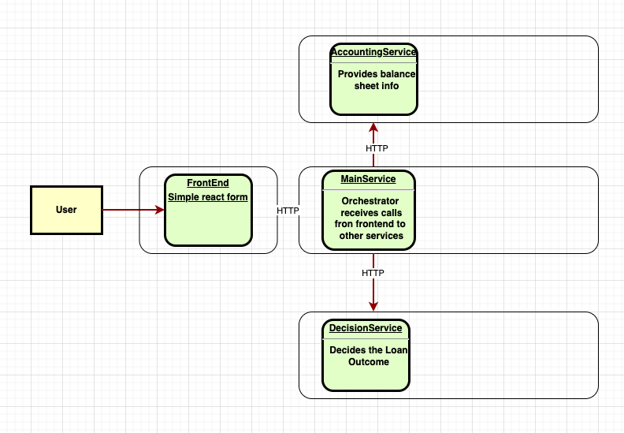

<!-- PROJECT LOGO -->
<br />
<div align="center">
  <a href="https://github.com/othneildrew/Best-README-Template">
    
  </a>

  <h3 align="center">Simple Bank Loan App</h3>

  <p align="center">
    A basic version of bank loan app with react front end and python flask backend services !
  </p>
</div>


<!-- TABLE OF CONTENTS -->
<details>
  <summary>Table of Contents</summary>
  <ol>
    <li>
      <a href="#about-the-project">About The Project</a>
      <ul>
        <li><a href="#built-with">Built With</a></li>
      </ul>
    </li>
    <li>
      <a href="#getting-started">Getting Started</a>
      <ul>
        <li><a href="#prerequisites">Prerequisites</a></li>
        <li><a href="#installation">Installation</a></li>
      </ul>
    </li>
    <li><a href="#usage">Usage</a></li>
  </ol>
</details>


<!-- ABOUT THE PROJECT -->
## About The Project

[

[


<p align="right">(<a href="#readme-top">back to top</a>)</p>


## Backend API services are divided in to 3 micro-services. 

* Mainservice - main orchestrator service to call other two microservices
* Accounting Service API - generate mock balance sheet
* Decision Service  - simulates decide loan application

## Frontend 

simple react app 

## Port Numbers

* Frontend run on - localhost:3000
* Application Service API run on - localhost:5000
* Accounting Service API run on - localhost:5002
* Decision Service API run on - localhost:5001


### How to run locally

```bash
# to run the web app (make sure to run npm install beforehand)


cd frontend
npm start 

# to run application api

# application-service-api
cd applicationservice
pipenv shell
python3 applicationservice.py

# accounting-service-api
cd applicationservice
pipenv shell
python3 accountingservice.py

# decision-service-api
cd decisionservice
pipenv shell
python3 decisionengine.py

## docker run
# harcoded the url of microservices for docker. Change the urls in mainservice and react to localhost for local testing.
docker compose up


### Folder structure

```bash
├── backend
    │ services  ├── decisionservice         
            │   ├── accountingservice         
            │   ├── mainservice         
└── frontend
    ├── public
    └── src

